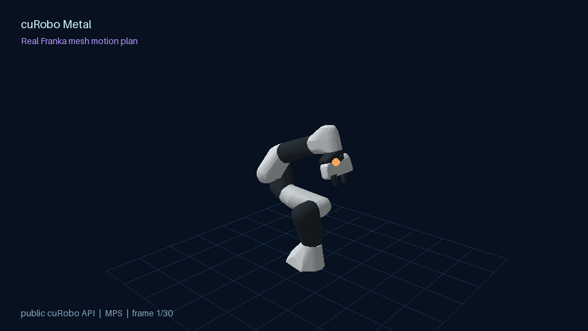

# cuRobo Metal

An Apple Silicon drop-in Python implementation of the portable API in pinned
[cuRoboV2](https://github.com/NVlabs/curobo).



The project currently provides:

- a dependency-free adapter for pinned cuRoboV2 robot configuration data;
- independent NumPy correctness oracles and canonical replay fixtures;
- differentiable PyTorch CPU/MPS forward kinematics, collision, costs, IK, and
  trajectory optimization;
- runtime-compiled Metal kernels for fused serial-chain kinematics and primitive
  collision queries;
- deterministic geometric planning, mesh, voxel/SDF, ESDF, and whole-body
  implementations behind explicit contracts;
- reproducible correctness, profiling, and benchmark artifacts.

The target distribution is installed as `curobo-metal` and exposes the original
`curobo` Python namespace, so portable applications change only their
dependency. Against the pinned revision, the strict public-facade gate is exact
for 24 modules, 122 exports, and 10 comparable callable signatures. The broader
generated inventory resolves 571 of 586 audited modules; the 15 partial modules
are two perception internals and 13 bundled example workflows. CUDA/Warp ABI
mechanisms and external integrations remain explicit substitutions or
exclusions. The ecosystem corpus resolves all 171 compatibility targets mined
from documentation, examples, tests, and downstream projects. See the
[project plan](https://github.com/AkeBoss-tech/curobo-metal/blob/main/PLAN.md),
[drop-in roadmap](https://github.com/AkeBoss-tech/curobo-metal/blob/main/docs/dropin-roadmap.md),
and [compatibility boundary](https://github.com/AkeBoss-tech/curobo-metal/blob/main/docs/compatibility.md).

> **Namespace warning:** NVIDIA cuRobo and `curobo-metal` both install the
> `curobo` Python package. They must not be co-installed. Use a dedicated virtual
> environment and uninstall `nvidia-curobo` (or any source-installed cuRobo)
> before installing this distribution. The release smoke test fails if another
> distribution also claims the namespace.

## Pinned upstream

Thirty portable V2 applications now have an installed-wheel execution gate with
automatic MPS selection, unchanged source hashes, and a CUDA replay bundle.
See [application compatibility](docs/application-compatibility.md) for covered
behavior, commands, paired CUDA evidence, and the bounded coverage of this gate.

Compatibility is developed against cuRoboV2 commit:

```text
8e734f3ced1df898990bcd92de40abce475907db
```

The repository includes tooling that fetches this exact revision and recomputes
the Git object ID:

```bash
tmpdir="$(mktemp -d /tmp/curobo-metal-upstream.XXXXXX)"
uv run python tools/upstream/manage.py fetch --destination "$tmpdir/curobo"
uv run python tools/upstream/manage.py verify --source "$tmpdir/curobo"
uv run python tools/upstream/manage.py audit --source "$tmpdir/curobo"
```

## Requirements

- Python 3.10–3.13
- PyTorch 2.13 or newer
- NumPy 1.24 or newer
- For GPU execution: Apple Silicon with an MPS-enabled PyTorch build

Metal shaders are compiled through `torch.mps.compile_shader`. A full Xcode
installation is not required for the current runtime-compiled kernels.

## Install and test

Version `1.0.0` is the first release of the pinned portable Python contract.
The source tree is preparing `1.0.1`, including the IK fix described below.
Exact behavior, known limitations, and exclusions are listed in the
[changelog](https://github.com/AkeBoss-tech/curobo-metal/blob/main/CHANGELOG.md)
and [parity matrix](https://github.com/AkeBoss-tech/curobo-metal/blob/main/docs/parity-matrix.md).

Use a clean virtual environment because this package and NVIDIA cuRobo own the
same `curobo` namespace:

```bash
python3 -m venv .venv
source .venv/bin/activate
python -m pip install --upgrade pip
python -m pip install curobo-metal
python -c "import curobo; print(curobo.__file__)"
```

### Minimal public-API example

```python
import torch

from curobo.kinematics import Kinematics, KinematicsCfg
from curobo.types import DeviceCfg, JointState

device = torch.device("mps" if torch.backends.mps.is_available() else "cpu")
robot = Kinematics(
    KinematicsCfg.from_robot_yaml_file("franka.yml", device_cfg=DeviceCfg(device))
)
q = torch.zeros((1, robot.dof), device=device)
state = robot.compute_kinematics(
    JointState.from_position(q, joint_names=robot.joint_names)
)
print(state.tool_poses.position)
```

The same example is available as [`examples/minimal_fk.py`](examples/minimal_fk.py).

### Visual motion-planning demo

The animation above is generated from a real public-API `MotionPlanner`
joint-space solve and FK pass. It renders the licensed low-poly Franka meshes
bundled with the robot description, not a schematic arm or canned trajectory:

```bash
uv run --extra demo python examples/visual_robot_planning_demo.py --device mps
```

The demo writes `docs/assets/franka-motion-plan.gif`. It uses Pillow only for
rendering; planning itself has no demo-specific dependency.

### Develop and test

Install the locked development environment with
[uv](https://docs.astral.sh/uv/):

```bash
uv sync --extra test
PYTORCH_ENABLE_MPS_FALLBACK=0 uv run pytest -q
```

Setting `PYTORCH_ENABLE_MPS_FALLBACK=0` is part of the validation contract. It
prevents unsupported GPU operations from silently executing on the CPU.

Run focused benchmarks:

```bash
PYTORCH_ENABLE_MPS_FALLBACK=0 uv run python benchmarks/kinematics/fused_fk.py
PYTORCH_ENABLE_MPS_FALLBACK=0 uv run python benchmarks/collision/fused_collision.py
PYTORCH_ENABLE_MPS_FALLBACK=0 uv run python benchmarks/ik/benchmark_ik.py
PYTORCH_ENABLE_MPS_FALLBACK=0 uv run python benchmarks/trajectory/benchmark_trajectory.py
```

The benchmark scripts synchronize the MPS device and report compilation/first
use separately from steady-state latency. The stable release regression limits
and current M4 results are recorded in [the performance gate](docs/performance.md).

Replay the pinned upstream forward-kinematics tutorial workload on Apple MPS:

```bash
PYTORCH_ENABLE_MPS_FALLBACK=0 uv run python \
  examples/upstream_forward_kinematics_mps.py \
  /path/to/pinned/curobo/content/configs/robot/franka.yml \
  --device mps --batch-size 1000
```

This loads upstream `franka.yml` directly and checks Metal transforms and
autograd against the independent float64 oracle. See the
[upstream example replay](https://github.com/AkeBoss-tech/curobo-metal/blob/main/docs/upstream-example-replay.md) for the
recorded result and the exact boundary around the CUDA-hardcoded original.

## Architecture

```text
cuRoboV2 configuration
          |
  dependency-free adapter
          |
  backend-neutral contracts
      /              \
NumPy oracles     PyTorch operators
                       |
                CPU or Apple MPS
                       |
             fused Metal hot paths
```

The NumPy implementations are executable specifications, not performance
backends. Production operators are first implemented with portable PyTorch.
Profiling evidence determines which launch-heavy paths receive fused Metal
kernels.

## Performance: Apple M4 versus RTX 3090

Apple Silicon is not a fundamental barrier to useful robot planning, but the
current Metal backend is not as fast as mature CUDA cuRobo for warm iterative
IK. The largest remaining gap is software as well as hardware: NVIDIA cuRobo
uses fused Warp/CUDA kernels and CUDA graph capture, while the portable IK path
still launches eager PyTorch/MPS operations and synchronizes inside an
iterative solve.

The following synchronized medians use matching public API calls and the same
pinned cuRoboV2 revision. They were measured on an Apple M4 Mac mini (10 CPU
cores, 16 GB unified memory) and an RTX 3090 (24 GB). Different PyTorch builds
and host systems mean this is a practical user comparison, not a GPU-isolation
study.

| Public workload | Apple M4 / Metal | RTX 3090 / CUDA | M4 warm gap |
| --- | ---: | ---: | ---: |
| FK, batch 1,024 (`1.0.0`) | 9.47 ms | 0.372 ms | 25.5× slower |
| FK, batch 1,024 (`1.0.1` candidate) | 3.79 ms | 0.372 ms | 10.2× slower |
| Moved-target IK (`1.0.0`, successful solves) | 315 ms | 5.87 ms | about 54× slower |
| Moved-target IK (`1.0.1` candidate) | 17.9 ms | 5.87 ms | 3.05× slower |
| Joint-space motion plan (`1.0.0`) | 110 ms | 89.9 ms | 1.22× slower |

The moved-target rows are a focused, already-seeded 32-seed Franka workload.
They should not be read as the latency of every IK problem. The broader local
release-gate reachable case measured 1.80 s for this candidate (under its 2.5 s
ceiling); it uses different initialization and is therefore not compared with
the RTX 3090 number above.

Cold-start behavior differs: the M4 completed the first FK call in about 53 ms
versus 212 ms on the RTX 3090, and the first motion plan in about 634 ms versus
1.85 s. Warm CUDA throughput is the stronger result; Metal can be attractive
for local development with low startup overhead.

The lower-level fused kernels are substantially faster than the complete public
objects around them. On the same M4, fused/low-level measurements included:

- FK at batch 1,024: about 2.43 ms (about 422,000 configurations/second);
- sphere-pair collision at batch 512: about 1.14 ms;
- sphere-to-cuboid collision at batch 512: about 0.80 ms.

PyPI `1.0.0` also exposed a moved-target IK reliability issue: 10 of 20
repeated solves succeeded in one clean-environment run. The current source tree
short-circuits refinement when the Levenberg–Marquardt seeds already satisfy
the tolerances, checks eager-MPS convergence after each LM step, and routes the
serial robot prefix through fused Metal FK. The same check produced 20/20
successes at about 17.9 ms median. The maximum position
error observed in that run was 2.93 mm, inside the configured 5 mm tolerance.
That fix is not part of the immutable `1.0.0` wheel and should ship in a patch
release before broad promotion.

The next performance work should focus on fused IK residual/normal-equation
kernels, eliminating the remaining host synchronization from optimizer loops,
and fusing quaternion conversion and robot-sphere transforms around FK.
An RTX 3090 should still be expected to lead warm throughput because it has far
more compute and memory bandwidth and a much more mature robotics kernel stack;
the remaining 3.05–10.2× IK/FK gaps are not all fundamental Apple Silicon limits.

These are machine-specific development measurements, not universal performance
claims. Solver settings, seed count, robot, scene, precision, and convergence
tolerances materially affect the result. Raw distributions, regression
protocols, and limitations are checked into `artifacts/profiling/` and
[`docs/performance.md`](docs/performance.md).

## Intended use and boundaries

`curobo-metal` is intended for cuRobo-compatible prototyping, research,
education, CI, and local robot-planning development on Apple Silicon. It is not
a CUDA/Warp ABI emulator, a hard-real-time controller, or a promise that every
NVIDIA example and external integration will run unchanged. Validate trajectories
on the target robot and control stack before deployment.

For a useful bug report, include the package version, macOS and chip, Python and
PyTorch versions, device (`mps` or `cpu`), robot/scene configuration, solver
settings, and a minimal reproducible script. Include synchronized warm timings
and first-call timing separately for performance reports.

## Numerical and autodiff boundaries

- Production Metal kernels currently target MPS `float32`.
- Fused FK currently supports serial chains up to 64 DoF.
- Custom Metal gradients provide tested first-order autodiff. Higher-order AD,
  `vmap`, export, and `torch.compile` compatibility are not claimed.
- Static cuboid worlds use the fused Metal path. Queries requiring gradients
  with respect to cuboid world parameters use the composed PyTorch path.
- Tiny batches may remain faster on CPU; benchmarked crossover points are
  documented rather than hidden.

## Development method

Every feature progresses through:

1. an explicit tensor/numerical contract;
2. an independent CPU oracle and canonical fixtures;
3. portable production CPU/MPS operations;
4. differential, gradient, and fallback-disabled tests;
5. synchronized profiling;
6. a fused Metal implementation only when evidence supports it.

See the [project plan](https://github.com/AkeBoss-tech/curobo-metal/blob/main/PLAN.md)
for the complete gated roadmap. Report bugs through the
[GitHub issue tracker](https://github.com/AkeBoss-tech/curobo-metal/issues);
the project does not provide a guaranteed support response time.
